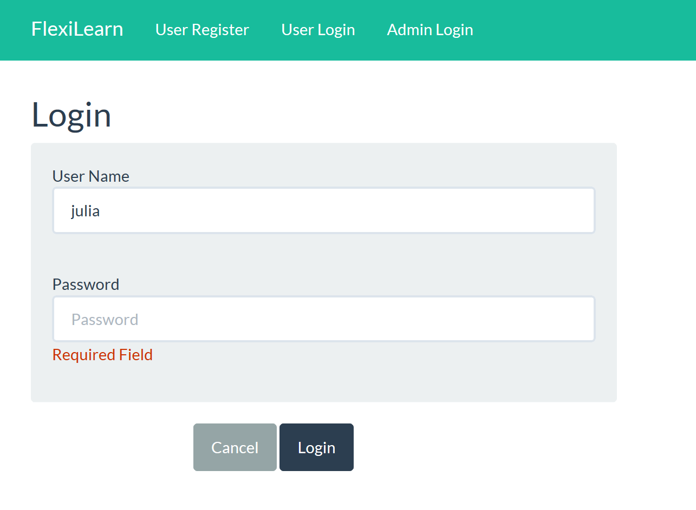
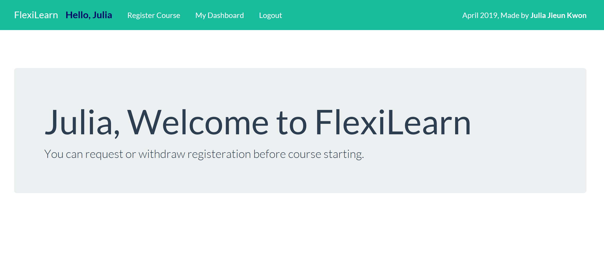
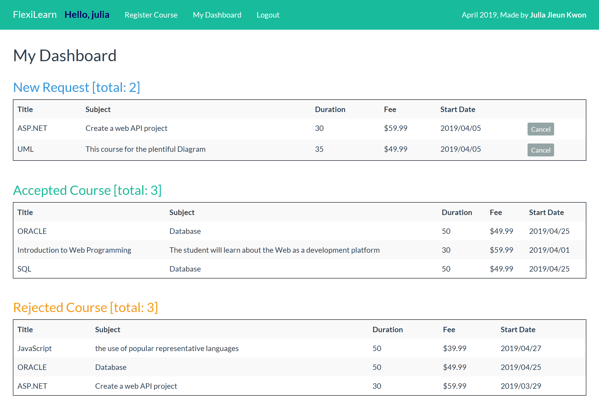

# CSharp_WebApp_CourseRegister
@ April 2019

Summary
-----

Create a Web Application, that allows users to search for Online Courses offered by an institution. 

Users can get the list of Courses and search for courses based on multiple fields.

Users request registration and view their registration status.

For the details, user can access users' page to manage their information such as My Order, My Account, and My Cart.

Before admin's accept user's request, user can withdraw their registration request.

Develop Environment
-----

- C#, ASP.NET

- MS-SQL 2017

- IDE : VS2017

- HTML, CSS, BootStrap, JQuery

Additional Technic
-----

- Authorization for user's access management

- Authentication in a hash-based account  

Salt and Hashed Password
----

A new random salt must be generated each time a user creates an account or changes their password.

<b>WorkFlow of Authentication in a hash-based account system  </b>

1. The user creates an account

2. Their password is hashed and stored in the database

3. When the user attempts to login, the hash of the password they entered is checked against the hash of their real password (retrieved from the database)

4. If the hashes match, the user is granted access. 

   If not, the user is told they entered invalid login credentials 
 

Page Details
-----

1. Login

2. Membership Register

3. Search Course

4. Register Course

5. View Registeration Status

6. Admin - Accept or Reject user's registration

Database
----

User Account

Admin Account

Course and Course Details

Course Register

Class Design
----

UserAccount

Admin

Course

Register

Pages
----

 <b> Users </b>
 
index.aspx - intro page with login navigation 

UserRegister.aspx - user account registeration

CourseList.aspx - allow user search course with keyword

CourseRegister.aspx - choose course and request register course

MyBoard.aspx - my course page with details of registration

<b> Admin </b>

Login.aspx - admin authorization

RegisterList.aspx - list of user's request, allow searching and sorting with key

UpdateRegister.aspx - accept or reject action about request

Page Features
----

1. Login

2. Main

3. Course Selection

4. My Dashboard

